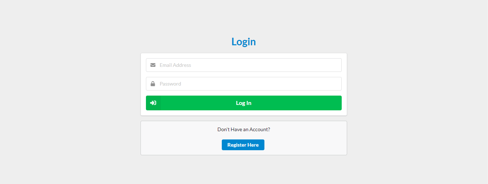

<h1>Web DevelopmentQuiz</h1>

**To use this app you'll need to create clone the report using `git clone https://github.com/HarryH-Tech/Web_Development_Quiz`.   Then navigate into the Web_Development_Quiz directory and run `npm install`. You'll need to sign up for a new firebase account and create a new app within the firebase console. After doing this you'll need to update the `firebaseConfig` object in the `firebase.js` file with the config object from your own firebase project (more information about this can be found here https://support.google.com/firebase/answer/7015592). Then run `npm run start` and you should see the screen below.   Ihope you enjoy using this app 😊**

